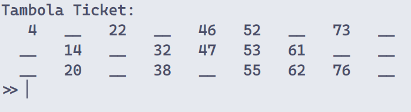

# [Report] Wireless Communication Lab 1

*January 17, 2024*

## Aim/Objective:

Write a MATLAB/Octave script to generate a Tambola/Housie/Bingo ticket with numbers ranging from 0 to 90. Ensure adherence to game rules, including each column containing at least one non-zero element. Implement a specific pattern for values in each column, e.g., 1st column (0-10), 2nd column (11-20), and so on.

## Background:

The script focuses on producing Tambola tickets with a 3x9 grid, adhering to rule compliance:
1. Each ticket comprises a 3x9 grid.
2. Every row and column must contain at least one non-zero element.
3. Numbers in each column are sorted in ascending order and follow a specific range pattern.

## Module Roles:

1. **`generate_rows.m`:**
   - Ensures each row contains at least one non-zero element.

2. **`generate_columns.m`:**
   - Generates random columns, ensuring at least one non-zero element in each column.
   - Implements a specific pattern for values in each column.

3. **`sort_columns.m`:**
   - Sorts each column in ascending order while maintaining the position of zero elements.

4. **`replace_zeros.m`:**
   - Replaces standalone zeros with '__' using regular expressions.

## Output:

## Conclusion:

This project underscores the fusion of theoretical knowledge in MATLAB functions, programming, and matrix manipulations with practical script development. The implementation involves a deep understanding of vectors, arrays, and matrices, showcasing the application of theoretical concepts in a real-world project with market relevance and a tangible use case.

The utilization of MATLAB functions for random number generation, sorting, and string manipulation exemplifies the practical integration of scripting knowledge. This project serves as an illustrative example of how theoretical concepts can be translated into a meaningful and applicable solution.

*Date of Submission: January 24, 2023*
