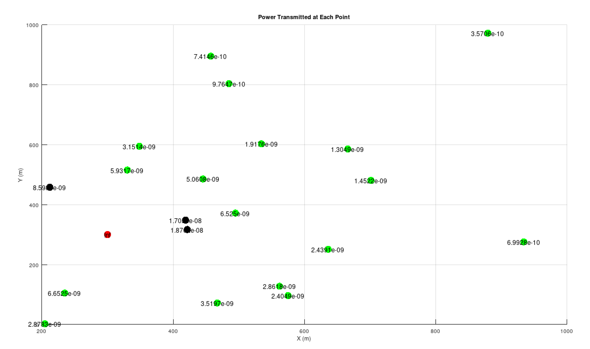

# Lab Report: Analysis of Power Transmission in Wireless Communication

**1. Aim/Objective:**

The aim of this code is to simulate a wireless communication scenario and calculate the power transmitted at different points in a given area. The code generates random coordinates for a set of points within a specified range and calculates the distances of each point from a reference point. Based on these distances, it computes the power transmitted at each point considering certain parameters such as transmit power, antenna gains, and frequency. Finally, it visualizes the power transmitted at each point using a scatter plot with color-coded markers.

**2. Theory:**

In wireless communication, the power transmitted from a transmitter decreases with distance due to propagation losses. This phenomenon is described by the inverse square law, where the power received at a certain distance \( d \) from the transmitter is inversely proportional to the square of the distance.

The transmitted power \( P_t \) at a given point can be calculated using the Friis transmission equation:

\[ P_t = \frac{{G_t \cdot G_r \cdot P_t \cdot \lambda^2}}{{(4\pi)^2 \cdot d^2}} \]

Where:
- \( G_t \) and \( G_r \) are the gains of the transmitting and receiving antennas respectively.
- \( P_t \) is the transmit power.
- \( \lambda \) is the wavelength of the signal.
- \( d \) is the distance between the transmitting and receiving antennas.

In this code:
- Random coordinates are generated for a set of points within a specified range.
- The distance of each point from a reference point is calculated using the Euclidean distance formula.
- The transmitted power at each point is computed using the Friis transmission equation.
- The results are visualized using a scatter plot, where the color of each marker represents the power transmitted at that point.

**3. Observation:**

**4. Conclusion:**

This code successfully simulates a wireless communication scenario and provides insights into the power transmitted at different points within a given area. By visualizing the power distribution, it helps in understanding the coverage and intensity of the transmitted signal across the region of interest.

**5. Future Scope:**

- This code can be extended to consider more realistic propagation models and environmental factors such as path loss, shadowing, and multipath fading.
- It can be further developed to analyze the effect of varying parameters such as transmit power, antenna gains, and frequency on the communication system's performance.
- Integration with optimization algorithms can be explored to optimize the placement of transmitters and receivers for better coverage and signal strength.
- Real-world measurements and validations can be conducted to validate the accuracy of the simulation results.

**References:**
- Wikipedia: [Friis transmission equation](https://en.wikipedia.org/wiki/Friis_transmission_equation)
- "Wireless Communications: Principles and Practice" by Theodore S. Rappaport
- "Antenna Theory: Analysis and Design" by Constantine A. Balanis