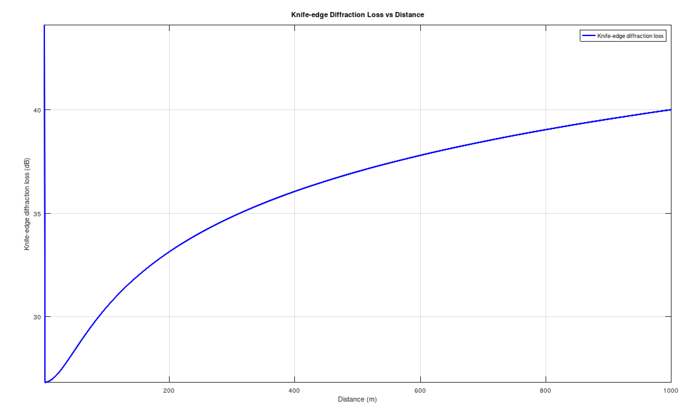

# Lab Report: Analysis of Knife-Edge Diffraction in Wireless Communication

## Aim/Objective
The aim of this lab experiment is to understand and analyze the knife-edge diffraction phenomenon in wireless communication systems. Specifically, we aim to investigate how obstacles such as buildings or terrain features can affect the propagation of radio waves, leading to variations in signal strength at different locations.

## Theory
Knife-edge diffraction is a phenomenon that occurs when radio waves encounter an obstacle, such as the edge of a building or a mountain ridge. As the waves diffract around the obstacle, they experience changes in amplitude and phase, resulting in variations in signal strength at different points in space.

The Fresnel diffraction integral and the Fresnel zones are commonly used to analyze knife-edge diffraction. The knife-edge diffraction loss can be calculated using empirical models such as the ITU-R P.526-15 model, which takes into account the heights of the transmitting and receiving antennas, the distance between them, and the wavelength of the signal.

## Observation
In this experiment, we simulated the knife-edge diffraction effect using Octave, a numerical computing software. We calculated the knife-edge diffraction loss for a given set of parameters, including the distance between the transmitter and receiver, the heights of the antennas, and the wavelength of the signal.

The simulation results were visualized using plots, which showed how the diffraction loss varies with distance between the transmitter and receiver. We observed that the diffraction loss increases with distance, reaching higher values for longer distances and lower antenna heights.

## Conclusion
Through this experiment, we gained insight into the knife-edge diffraction phenomenon and its impact on wireless communication systems. We learned that obstacles in the propagation path can cause signal attenuation and affect the coverage and performance of wireless networks. Understanding and mitigating these effects are essential for designing reliable and efficient wireless communication systems.

## References
- [Wikipedia: Friis transmission equation](https://en.wikipedia.org/wiki/Friis_transmission_equation)
- Theodore S. Rappaport, "Wireless Communications: Principles and Practice"
- Constantine A. Balanis, "Antenna Theory: Analysis and Design"
