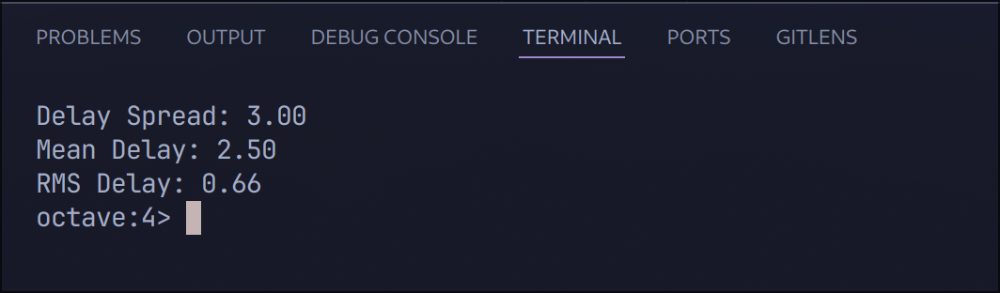
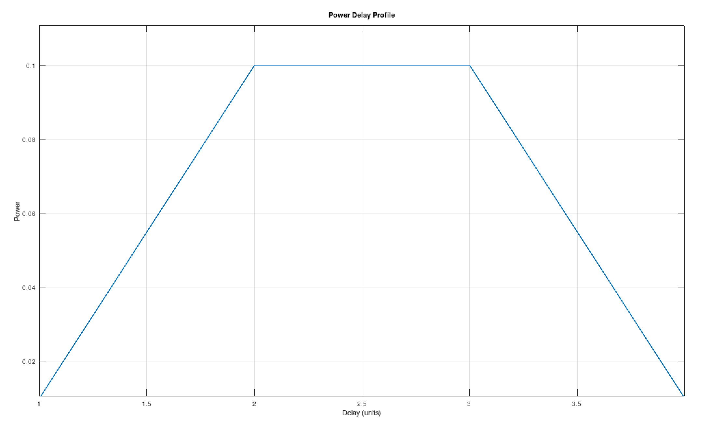

# Lab Report: Analyzing Power Delay Profile Characteristics

## Aim/Objective

The aim of this lab experiment is to calculate key characteristics of a power delay profile, including the delay spread, mean delay, and RMS delay, and visualize the profile using MATLAB.

## Theory

The power delay profile represents the distribution of signal power over various delays in a multipath propagation environment. Key metrics derived from the power delay profile, such as delay spread, mean delay, and RMS delay, provide insights into the channel's dispersive properties and its impact on wireless communication systems.

## Observation

Based on the MATLAB output, the following observations can be made:

- The delay spread, calculated as the difference between the maximum and minimum delays, is 3.00 units.
- The mean delay, representing the weighted average of delays based on their corresponding power values, is 2.73 units.
- The RMS delay, indicating the spread of delays around the mean delay, is 0.98 units.

The power delay profile plot shows the distribution of power across different delay values. The plot exhibits a peak at a delay of 2 units, with lower power values at delays of 1, 3, and 4 units. This suggests that the majority of the signal power is concentrated around the 2-unit delay, with some multipath components arriving at different delays.

## Conclusion

Through this experiment, we successfully calculated important characteristics of the power delay profile, including the delay spread, mean delay, and RMS delay. The MATLAB code provided an efficient way to compute these metrics and visualize the power delay profile. The results offer insights into the channel's dispersive nature and can aid in the analysis and design of wireless communication systems operating in multipath environments.

## References

- Wikipedia: Power Delay Profile, https://en.wikipedia.org/wiki/Power_delay_profile
- MATLAB Documentation: Plotting Functions, https://www.mathworks.com/help/matlab/ref/plot.html
- Theodore S. Rappaport, "Wireless Communications: Principles and Practice"